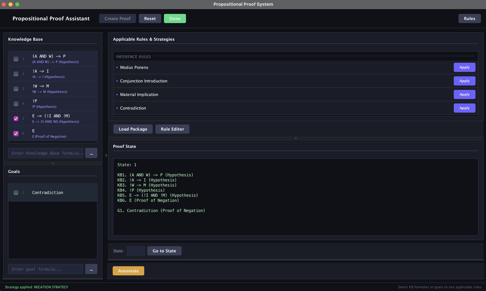
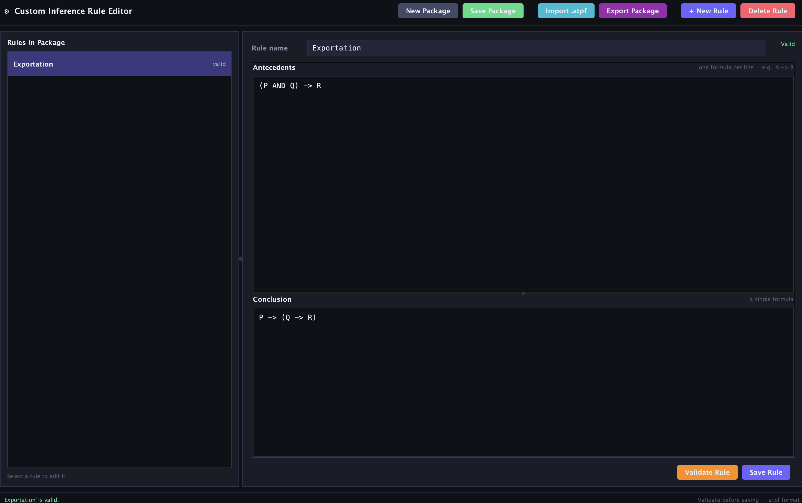

# Hybrid Theorem Prover for Propositional Logic

A hybrid theorem prover designed for both educational and research
purposes in the field of Propositional Logic. It bridges the gap between
manual, step-by-step proof construction and fully automated proof
search.

## Features

-   **Hybrid Reasoning:** Supports both manual, guided proof
    construction and fully automated proof search.
-   **Proof Transparency:** Generates human-readable proofs.
-   **Efficient Architecture:** Uses ASTs for formula representation and
    BDDs for equivalence checking and tautology detection.
-   **Extensible:** Supports package-based custom inference rules.
-   **Intuitive GUI:** Provides real-time proof state tracking.

## Project Structure

    project/
    ├── files/
    ├── src/
    ├── pom.xml
    └── README.md

The repository contains only the source code. The `target/` directory is
**not** included and is created automatically by Maven during the build
process.

## Prerequisites

-   JDK 17 or newer
-   Apache Maven 3.8+

### Installing Java (JDK)

**Ubuntu / Debian:**

```bash
sudo apt update
sudo apt install openjdk-17-jdk
```
**macOS (Homebrew):**

```bash
brew install openjdk@17
```

**Windows**

1. Go to [https://adoptium.net/temurin/releases](https://adoptium.net/temurin/releases)
2. Select:
   - **Operating System:** Windows
   - **Architecture:** x64
   - **Version:** 17 (LTS)
   - **Package Type:** JDK
3. Download the `.msi` installer.
4. Run the installer and follow the on-screen instructions.

**During installation, ensure the following options are selected:**

- **Add the installation to the PATH environment variable**
- **Associate .jar files with Java applications** 
- **Updating the JAVA_HOME environment variable**

### Installing Maven

**Ubuntu / Debian:**

```bash
sudo apt update
sudo apt install maven
```
**macOS (Homebrew):**

```bash
brew install maven
```

**Windows**

Follow the official installation guide: [https://maven.apache.org/install.html](https://maven.apache.org/install.html)

**Quick Steps:**

1. Download the **Binary zip archive** from the link above.
2. Extract the archive to a directory (e.g., `C:\apache-maven`).
3. Add the `bin` folder (e.g., `C:\apache-maven\bin`) to your system `PATH` environment variable.

**Note:** For alternative installation methods on Windows, you can also use package managers like Chocolatey (`choco install maven`) or Scoop (`scoop install main/maven`).

Verify:

``` bash
java -version
javac -version
mvn -version
```

## Installation

Clone the repository:

``` bash
git clone <repository-url>
cd <repository-folder>
```

Compile:

``` bash
mvn clean compile
```

Run tests:

``` bash
mvn test
```

Package the application:

``` bash
mvn clean package
```

After packaging, Maven creates the `target/` directory automatically.

## Running

### GUI

This is the recommended way to use the theorem prover, as it provides the full interactive experience with real-time feedback and visual proof state tracking.

```bash
java -jar target/theorem-prover.jar gui
```
**Main Interface:**

The main workbench provides access to the Knowledge Base, Goals, applicable inference rules, proof state, and automated proof output.



**Rule Editor:**

The Custom Rule Editor allows you to create, validate, and manage your own inference rules without modifying the source code.



### Automated CLI

``` bash
java -jar target/theorem-prover.jar automated input=files/input.txt output=files/output.txt rules=files/rules.txt --indentedProof --formalProof
```

Arguments:

-   `input` -- input proof file (default: `files/input.txt`)
-   `output` -- output destination (default: console)
-   `rules` -- rule configuration (default: `files/rules.txt`)
-   `--indentedProof` -- print indented proof
-   `--formalProof` -- print formal proof

### Manual CLI

``` bash
java -jar target/theorem-prover.jar manual
```

### Tests

``` bash
java -jar target/theorem-prover.jar test
```

## Contact

-   **Author:** Darian-Raul Sandru
-   **Coordinator:** Lect. Dr. Adrian Craciun
-   **Affiliation:** West University of Timișoara, Faculty of Computer
    Science
